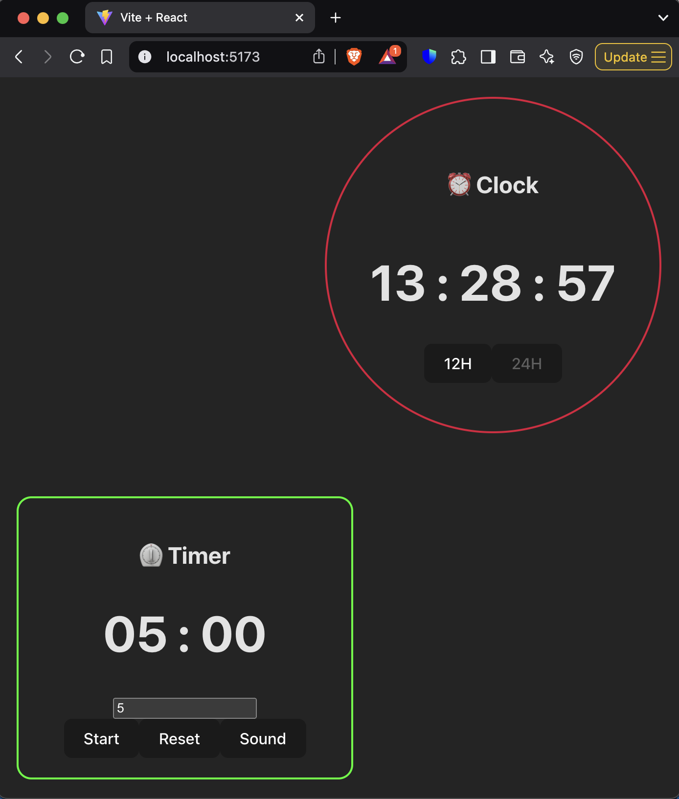

# React Clock and Timer App

This is a simple React application that displays a clock and a timer. The clock shows the current time, while the timer allows users to set a countdown and play a sound when the timer ends.

## Features

- **Clock**: Displays the current time in either 12-hour or 24-hour format. Users can toggle between the two formats.
- **Timer**: Allows users to set a countdown timer in minutes and seconds. Plays a sound when the timer reaches zero.
- **Responsive Layout**:
  - The clock is positioned at the top-right corner of the browser.
  - The timer is positioned at the bottom-left corner of the browser.

## Technologies Used

- React (with hooks like `useState`, `useEffect`, and `useRef`)
- Vite (for fast development and optimized builds)
- JavaScript
- CSS (inline styling for layout and design)

## Installation

1. Clone this repository:

`git clone https://github.com/yauheniya-ai/Timer.git`

2. Navigate to the project folder:

`cd Timer`

3. Install dependencies:

`npm install`

4. Start the development server:

`npm run dev`

5. Open your browser and navigate to:

`http://localhost:5173`

## File Structure

- `src/main.jsx`: The main entry point of the app.
- `src/App.jsx`: The root component that renders the ClockTimer component.
- `src/ClockTimer.jsx`: The main component that contains both the clock and timer functionalities.
- `src/App.css`: The CSS file for styling the App component.
- `public/timer-sound.mp3`: The sound file that plays when the timer ends.

## How to Use

1. **Clock**:
- By default, the clock shows the current time in 24-hour format.
- Use the "12H" button to switch to 12-hour format.
- Use the "24H" button to switch back to 24-hour format.
2. **Timer**:
- Enter the desired number of minutes in the input field.
- Click "Start" to begin the countdown.
- Click "Reset" to stop and reset the timer.
- Click "Sound" to manually play the timer sound.

## Customization

You can customize this app by:

- Changing the styles in the inline `style` objects.
- Replacing `public/timer-sound.mp3` with your own sound file.

## Contributing

Feel free to fork this repository, make changes, and submit a pull request. Any contributions are welcome!

## License

This project is licensed under the MIT License. See [LICENSE](LICENSE) for more details.

---

Happy coding! 🚀
